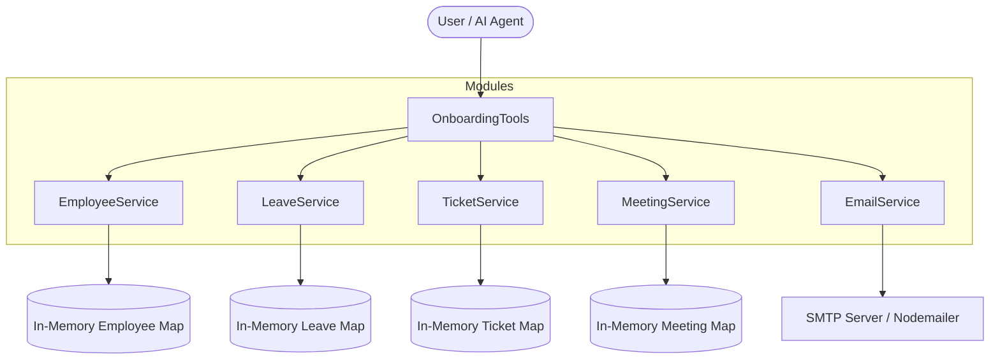
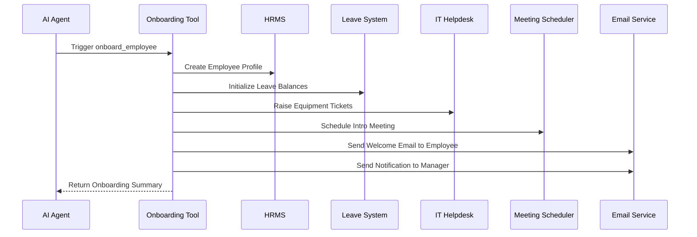

 HR Automation Application

## Overview

A comprehensive Human Resources automation platform designed to streamline employee management, leave processing, meeting scheduling, IT ticketing, and onboarding workflows. Built with NitroStack, this application acts as an MCP server featuring intelligent agent-driven task orchestration and interactive UI widgets.

## Core Features

- **Employee Management:** Add employees, retrieve details, search by name, and manage organizational hierarchies.
- **Leave Management:** Track leave balances, process applications, and maintain comprehensive leave history.
- **Meeting Scheduler:** Schedule, view, and cancel meetings with built-in conflict detection.
- **IT Ticketing:** Create and track equipment requests for laptops, monitors, and accessories.
- **Email Automation:** Automated notifications for onboarding, approvals, and updates via SMTP.
- **Smart Onboarding:** Full onboarding workflow triggered from a single prompt, orchestrating multiple services simultaneously.

## System Architecture

The application is structured into modular domain services, utilizing dependency injection for inter-module communication. Data is currently managed using fast in-memory stores, which can be swapped out for persistent databases in production.



## Smart Onboarding Workflow

The smart onboarding tool acts as an orchestrator, completing a multi-step workflow securely and efficiently from a single user prompt.



## Getting Started

### Prerequisites

- Node.js (v18 or higher)
- npm or yarn

### Installation

1. Install dependencies:
```bash
npm install
```

2. Configure environment variables:
Copy the `.env.example` file to `.env` and provide your SMTP credentials for email automation.
```bash
cp .env.example .env
```

3. Start the application:
```bash
npm run dev
```

### Running with Nitro Studio

This application is fully compatible with Nitro Studio for testing and interacting with the MCP server tools and widgets.

- Download Nitro Studio: https://nitrostack.ai/studio
